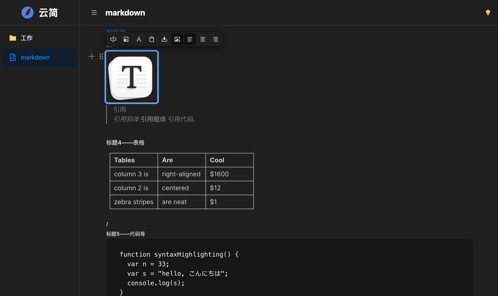

# 云简 - 执笔云上，简纳万千

云简 是一款轻量级、自托管的私有云笔记应用。它采用“纯文件存储”架构，配合现代化的 Web 界面，确保您的数据始终掌控在自己手中。



## 核心特性

- **纯文件存储**：所有笔记均作为标准的 `.md` 文件存储在您的服务器磁盘上，无需数据库。
- **双层存储架构 (Double Buffering)**：
    - **极速层**：实时保存到浏览器 `IndexedDB`/`LocalStorage`，输入即保存。
    - **持久层**：异步同步到服务器文件系统。
    - **离线支持**：断网状态下可继续写作，网络恢复后自动同步。
- **增量更新 (Incremental Updates)**：采用 Google 的 `diff-match-patch` 算法，仅传输变更部分（补丁），极大节省带宽并提升弱网环境下的稳定性。
- **现代化编辑器**：基于 BlockNote 的块级富文本编辑器，支持 Markdown 快捷键。
- **暗色模式**：完美适配的深色/浅色主题切换。
- **文件管理**：支持拖拽移动文件、重命名、文件夹管理等操作。
- **安全**：简单的密码访问保护。

## Docker 快速部署

使用 Docker Compose 可以在几秒钟内完成部署。

```yaml
version: '3.8'

services:
  cloudnote:
    image: qazzxxx/cloudnote:latest
    container_name: cloudnote
    ports:
      - "6631:3000"
    environment:
      - PASSWORD=your_secure_password  # 在此处设置您的登录密码
      - DATA_DIR=/app/data
    volumes:
      - ./data:/app/data               # 将笔记数据持久化到宿主机
    restart: unless-stopped
```

## 环境变量

| 变量名 | 描述 | 默认值 |
|----------|-------------|---------|
| `PORT` | 服务器监听端口 | `3000` |
| `DATA_DIR` | 笔记存储目录 | `./data` |
| `PASSWORD` | 访问密码 | `123456` |

## 📈 历史 Star | Star History

[](https://www.star-history.com/#qazzxxx/cloudnote&type=date&legend=top-left)

## 许可证

MIT
